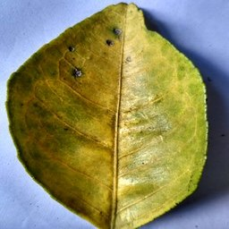
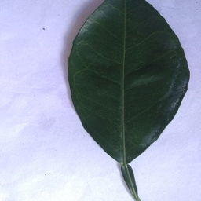
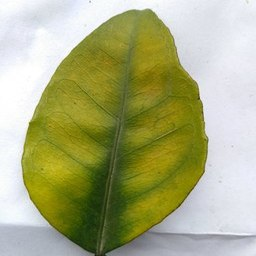

# caffe_penlu

**This is the code implementation we implemented about the published paper "Identification of navel orange lesions by nonlinear deep learning al[gori]()thm".

**The download address of the paper is: [https://www.scielo.br/j/eagri/a/vJBbggfFXQw7RkcLQMXN87D/?format=pdf&amp;lang=en](https://www.scielo.br/j/eagri/a/vJBbggfFXQw7RkcLQMXN87D/?format=pdf&lang=en)

We implement it under the caffe framework. For detailed caffe information, please refer to its official website： [https://github.com/BVLC/caffe](https://github.com/BVLC/caffe "https://github.com/BVLC/caffe")

How to use our code?

1. Download the official caffe package
2. Download our PEBLU package
3. Refer to PENLU's caffe.proto to modify the official caffe.proto (it is located under caffe/src/proto/)
4. Merge the *include* and *src* in PENLU to the official caffe
5. Compile caffe according to the official caffe compilation method, Please refer to: [Caffe | Installation (berkeleyvision.org)](http://caffe.berkeleyvision.org/installation.html#compilation)
6. We provide some examples of our use of PENLU in network structures. For detailed network structure, please refer to *caffe_penlu/models*.
7. The network structure used by navel orange recognition is located in *caffe_penlu/navel_orange/*
8. The image data used for navel orange identification is stored in CSDN, click the link to download: [https://download.csdn.net/download/xunan003/87283623?spm=1001.2014.3001.5503](https://download.csdn.net/download/xunan003/87283623?spm=1001.2014.3001.5503)

Regarding the 3rd method of use, you need to add the registration part of the penlu layer to caffe.proto in caffe, as follows:

```protobuf
message LayerParameter {
  optional string name = 1; // the layer name
  optional string type = 2; // the layer type
  repeated string bottom = 3; // the name of each bottom blob
  repeated string top = 4; // the name of each top blob
  .......
  .......
  .......
  .......
  optional PENLUParameter penlu_param = 151; // 151 is the id, which is not the same as the id of other registration parameters
}
...
...
...
message V1LayerParameter {
  repeated string bottom = 2;
  repeated string top = 3;
  optional string name = 4;
  .......
  .......
  .......
  .......
  optional PENLUParameter penlu_param = 50; // 50 is the id, which is not the same as the id of other registration parameters
}
...
...
...
message PENLUParameter {
  optional FillerParameter alpha_filler = 1; // default = 1
  optional FillerParameter beta_filler = 2; // default = 1
  optional FillerParameter eta_filler = 3; // default = 1

  // Whether or not slope paramters are shared across channels.
  optional bool channel_shared = 4 [default = false];
}
```

  
